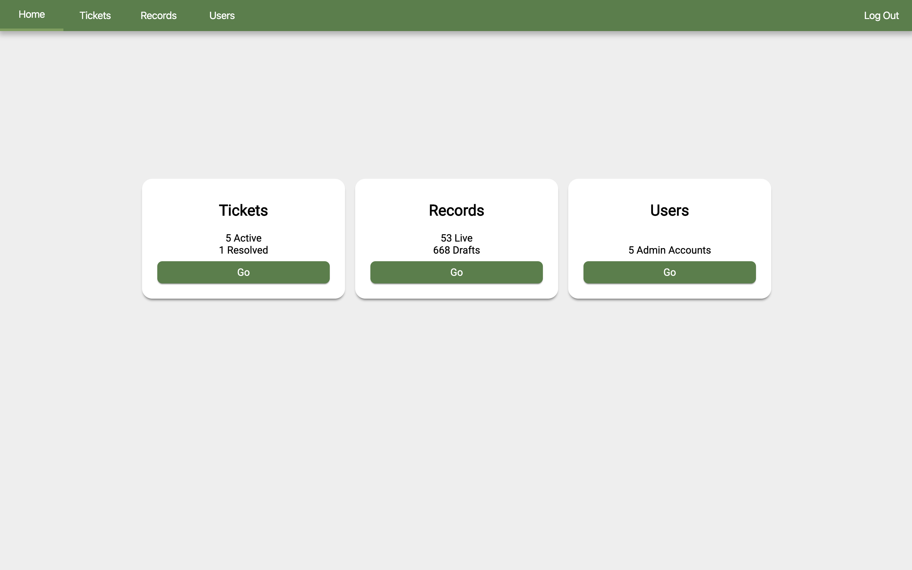

# The Green Neighbor Project
This is a collaborative, capstone project done for our client Andrew Butts of The Green Neighbor Challenge as a part of Prime Digital Academy.

Duration: 2.5 Week Sprint.

70% of households in the US have access to green energy programs, but utility companies have no incentive to publicize that information. Our client has been aggregating information about these programs along with his research team and wants to create a web application that makes that information easily accessible to the public.

## Visuals
Below: The current admin facing dashboard where Andy and his team will handle admin-side activities.

Below: The current client facing home page. This page is considered the landing page for all users navgating to the site.

### Project Goals
The end product will be a public facing website and an admin management page. Users will be able to enter in their zip code, view energy programs near them, and then be redirected to those program websites to sign up. This will be combined with connections to social media to spread awareness as well as opportunities for users to contribute to the project by supplying information.

The admin page will be a control panel for managing information about utility companies and energy programs they offer. The admin page will also be able to review crowdsources information from users.

#### Software Requirements (Assuming a Mac is used.)
- Node.js (https://nodejs.org/en/)
- ReactJS (https://reactjs.org/)
- Postgres (pg)
- Geocode Api (https://developers.google.com/maps/documentation/geocoding/start)
- A full list of the dependecies can be found  in the package.json file. These will be installed by running 'npm install' after downloading the repository and navigating to the folder in your test-editing software.

##### Usage and Installation
1. Fork from master on the repository, or, download/ clone the repository link.
2. In your coding program, open terminal and run: 'npm install'
3. Set up your database and name it 'green_neighbor'.
4. In Terminal: 'npm run database.sql' this will run the .sql file and fill your database up. (Make sure you have postgres set-up or a program like Postico set-up and running.)
5. Spin up server: 'npm run server'
6. In a separate terminal, fire uop your client: 'npm run client'.
7. By default, web page is set to default 'localhost:3000/' If errors, double check your port is set to 3000.
8. Enjoy!

###### Built With
- Javascript
- React.js
- Node.js
- Postgressql
- Express
- Heroku
- HTML5
- CSS
- Redux
- Sagas
- Material-UI
- Style-components
- Database Sytem (Postico)
- Geocoding API

## Acknoledgement
Thank you Andrew Butts and the Green Neighbor Challenge for letting us build you a fantastic web-tool.
From the team: Korey Peterson, David Mercer-Taylor, Luke Peña, Ben Stretar.

## Support
If you have any suggestions, issues, found a bug, or anything else, please reach out to Andrew Butts: andrewdbutts@gmail.com for help and assistance.
